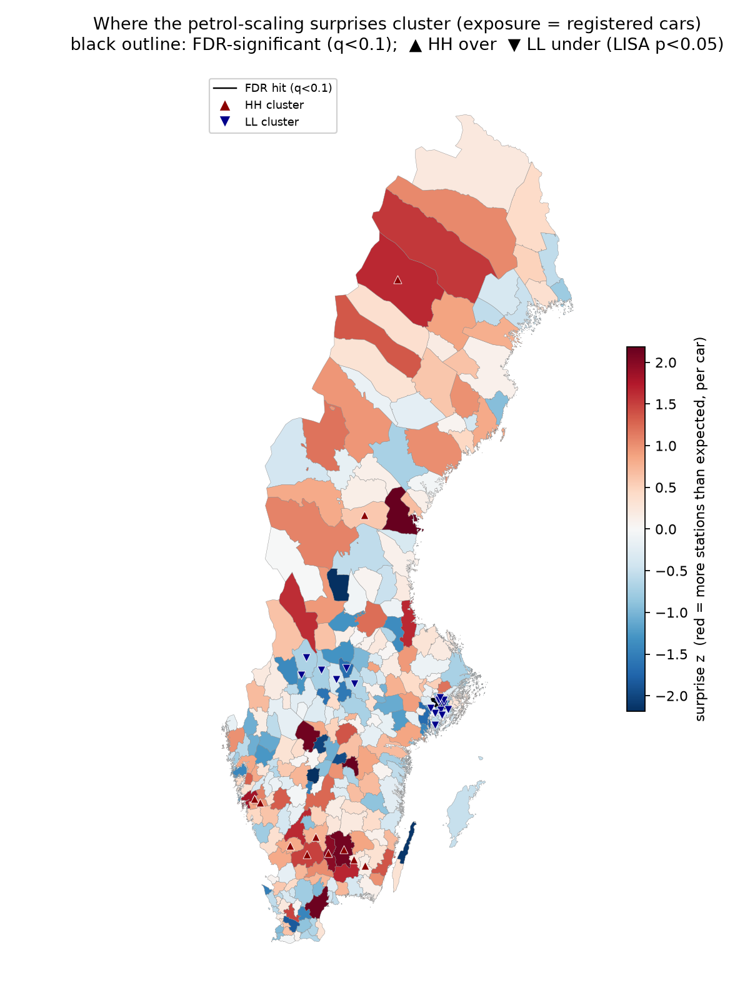
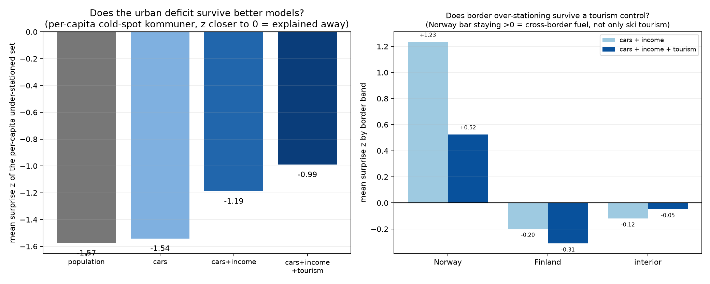
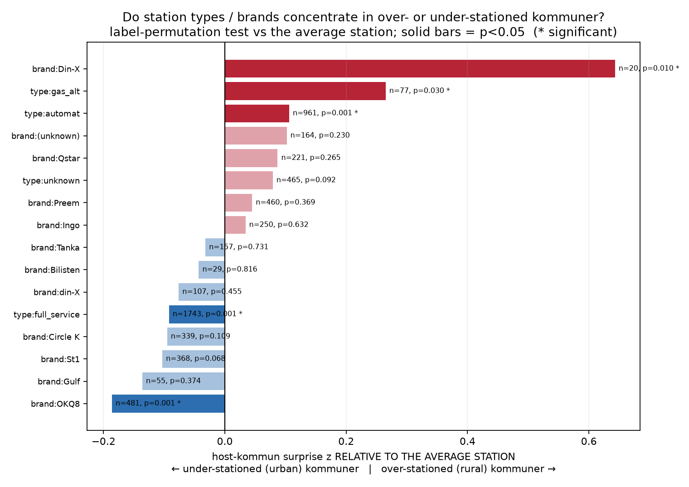

# How many petrol stations should a place have? Scaling, surprise, and the geography of fuel demand in Sweden

*A working manuscript / extended notes. National CRS EPSG:3006, random seed 17. Numbers in this document come from the pipeline in `run_all.sh` (phases 1–9); see `results.json`, `surprise_summary.json`, `tourism_summary.json`, and `methods.md` for exact figures, vintages, and sources.*

---

## 1. Why bother

There is a robust empirical regularity in the study of cities: many quantities scale with population as a power law, `Y = C · Sᵝ`, and the exponent `β` is informative. Socio-economic outputs (wages, patents, GDP) tend to scale *superlinearly* (β > 1): big cities are disproportionately productive. Physical infrastructure that *serves space* — road surface, electrical cable, gas pipe — tends to scale *sublinearly* (β ≈ 0.75–0.90): big cities are more infrastructure-efficient per capita, because density lets the same pipe or road serve more people.

Petrol stations are an interesting test case sitting between those worlds. They are physical infrastructure that serves space, so the prior says sublinear. But they serve a *mobile* demand — cars in motion, not residents at addresses — so the relationship between "stations" and "resident population" is mediated by car ownership, commuting, freight, tourism, and cross-border price arbitrage. That makes petrol stations a good lens for a sharper question than "what is β":

> **Once you fit the scaling law, where and why does reality deviate from it — and what do those deviations reveal about who actually buys fuel where?**

The exponent `β` is the all-Sweden summary. The **residuals are where the structure lives.** This document is about both, but mostly about the residuals.

We use Sweden because the data are unusually good: OpenStreetMap gives near-complete station locations, and Statistics Sweden (SCB) and Eurostat give clean population, registered-vehicle, income, and geographic-unit data at municipal resolution.

---

## 2. The estimator question (and why the obvious method is wrong)

The textbook way to estimate a scaling exponent is to take logs and fit a straight line: `log P = log C + β·log S` by ordinary least squares (OLS). For petrol stations this is **the wrong estimator**, and seeing why sets up everything that follows.

Petrol-station counts per unit are small integers, and many units have **zero, one, or two** stations. That breaks log-log OLS in two ways:

1. **`log 0` is undefined.** Zero-station units must be dropped or fudged. Dropping them is selection on the outcome — you are conditioning on `P > 0` — and it biases the slope. (In our tätort data, dropping the 1,113 zero-station settlements changes β from 0.78 to 0.46. The "tweak" is not cosmetic.)
2. **Discreteness and heteroskedasticity.** At a count of 1 vs 2, you have moved by a *factor of two* in log space on the strength of a single station. The Poisson noise on small counts is enormous, and OLS — which assumes constant-variance Gaussian errors — treats that noise as signal and lets the low-count tail lever the line. This is exactly the "horizontal blow-out" one sees in the log-log scatter at small S.

A tempting fix is to **merge small geographical units until each has some minimum number of stations.** This is *confused statistics*. Merging units *because* their counts are low is selection on the dependent variable; worse, it makes the estimated exponent depend on an arbitrary threshold and merge rule — a manifestation of the **Modifiable Areal Unit Problem (MAUP)**, to which we return. Principled aggregation (to a pre-defined geography, applied to all units) is fine; aggregation-to-hit-a-count is not.

**The correct estimator is a count model.** We fit an *inhomogeneous* Poisson / Negative-Binomial generalized linear model (GLM) with a log link:

```
P_i ~ NegativeBinomial(μ_i, α),    log μ_i = a + β·log S_i
```

Each unit *i* gets its own expected rate `μ_i = C · S_iᵝ`; the power law lives in the **mean**, and the count noise around it is a separate, properly-specified layer. Zeros are kept and handled natively. Low counts are simply high-variance draws from the same law, not violations of it. The scaling exponent `β` is read straight off the coefficient, and `H₀: β = 1` (linear / scale-free provision) is a one-line z-test. We use the Negative Binomial whenever a Poisson dispersion check exceeds ~1.2 (it usually does), so the confidence intervals on `β` are honest rather than artificially tight.

Throughout, OLS-on-logs is kept only as a deliberately-biased *foil* — to show what the older scaling literature's method would have reported, and why it misleads.

---

## 3. The headline: petrol provision is sublinear, and the exponent depends on the unit

Fitting Model A across four definitions of "a place":

| Unit definition | n units | Σ P | β (Model A) | 95% CI | H₀: β=1 |
|---|--:|--:|--:|---|---|
| Tätort (settlement) | 2017 | 2751 | **0.777** | [0.761, 0.793] | sublinear |
| Tätort + småort | 5114 | 2900 | **0.808** | [0.794, 0.821] | sublinear |
| FUA (functional urban area) | 12 | 1290 | **0.661** | [0.610, 0.712] | sublinear |
| Kommun (administrative) | 290 | 3246 | **0.592** | [0.545, 0.638] | sublinear |


Two things matter here.

**(a) The qualitative result is robust.** Every definition is sublinear and every CI excludes β = 1. Doubling a settlement's population multiplies its stations by only ≈ 2^0.78 ≈ 1.7 — larger places are genuinely more station-efficient per capita. The tätort headline (0.78) sits squarely inside the 0.75–0.90 "space-serving infrastructure" band from the urban-scaling literature.

**(b) The *magnitude* is not unit-invariant — and that is itself a result.** β ranges from 0.59 (kommun) to 0.81 (tätort+småort). This is MAUP in the open: kommuner bundle a dense town together with its sparse rural hinterland into one large-S unit, which drags the high-S end down and exaggerates sublinearity; tätorter measure settlement-*internal* scaling only. **There is no single "true" unit.** The honest move is to *state the unit with the exponent*, and to match the unit to the question (§6).

A secondary finding: it is not even a clean *single* power law. A `(log S)²` term is significant for tätorter (p ≈ 6.5e-9); a segmented fit breaks near S ≈ 3,700 inhabitants, with slope ≈ 0.90 below and ≈ 0.74 above. The largest cities scale *more* sublinearly than small towns.

---

## 4. The residuals are the point: per-unit "surprise" and whether it clusters

A fitted scaling law assigns each kommun an expected number of stations. The interesting question is which places deviate, and whether those deviations mean anything. The trap is that **rare events happen**: under any correct model, some units will land far in the tail by chance. A single surprising kommun proves nothing. The signal is **structure in the tail** — if surprising units *cluster* geographically or by brand, the null model of independent draws cannot easily produce that.

We made this formal (Phase 8):

- **Per-unit surprise.** For each kommun we compute a *randomized-quantile residual* `z` — the right tool for counts: it is ≈ N(0,1) under the true model and is discreteness-correct, so a kommun with 0–2 stations is scored honestly rather than blowing up. Plus a two-sided mid-p tail probability.
- **Multiplicity control.** Benjamini-Hochberg FDR across all 290 per-unit p-values, so we don't get fooled by the "rare things happen" problem.
- **Geographic clustering.** Global Moran's I on `z` (6-nearest-neighbour spatial weights, row-standardized) with a permutation null, then *local* Moran (LISA) to locate and name hot/cold clusters.
- **Brand clustering.** Each station inherits its host-kommun `z`; a label-permutation test asks whether a station *type* or *brand* sits systematically in over- or under-stationed kommuner.

The first result is the cleanest illustration of the whole philosophy:

> **Marginally, the tail looks exactly like the null.** Under the population model, 14 kommuner have |z| > 1.96 against 14.5 expected by chance, and **zero** survive FDR. You cannot defend any single kommun as an outlier. **But the spatial arrangement is wildly non-null:** global Moran's I = 0.42, p = 0.001 (a ~13σ departure from the permutation null). The surprises are not independent — they cluster hard.

No individual point is conclusive; their geographic organization is. That is the entire argument, confirmed in one dataset.



The clusters fall into two families: an **under-stationed cold spot** covering the entire Stockholm metropolitan ring (Sundbyberg, Solna, Nacka, Danderyd, Lidingö, Huddinge…), and **over-stationed hot spots** in the sparse north and in interior Småland. The rest of the document is about explaining these.

---

## 5. Is population even the right denominator? Cars, and a surprise

People do not buy fuel; cars do. And urban residents own fewer cars per capita (transit, density, cost of parking). So part of the apparent sublinearity could be "cities just own fewer cars," not genuine provision economies. We swapped the denominator to **registered passenger cars** (SCB/Trafikanalys, all 290 kommuner):

- β rises from **0.592 (people) → 0.681 (cars)**. Cars-per-capita do fall with size (0.60 small kommuner → 0.49 large), accounting for ≈ 22% of the gap from linearity. But β = 0.68 is still firmly sublinear: **real provision economies survive the confounder.** The naïve population exponent simply overstated the effect by ≈ 0.09.


The genuinely surprising part appears when we ask whether cars explain the *Stockholm cold spot*. They barely move it:

| | mean surprise z of the per-capita under-stationed kommuner |
|---|--:|
| population | −1.57 |
| **cars** | **−1.54** |
| cars + income | −1.19 |
| cars + income + tourism | −0.99 |

Switching to cars shifts the metro deficit from −1.57 to −1.54 — essentially nothing. **Greater Stockholm is under-stationed even per registered car.** Stockholm municipality itself sits at z ≈ −2.9 under the best model. So the convenient "cities own fewer cars" story, while true for the global exponent, does *not* account for the metro deficit. Something else is going on — and the first candidate is the unit boundary itself.

---

## 6. The unit boundary makes the metro deficit — functional aggregation mostly dissolves it

Solna, Sundbyberg, and Danderyd have no natural *fuel-market* boundary with Stockholm. People refuel near workplaces and along arterials, not where they sleep. Slicing one continuous urban fuel market into a dozen residential kommuner mislabels normal cross-boundary demand as suburban starvation. This is MAUP again, now as a substantive confound rather than a nuisance.

The principled test is to aggregate to **functional urban areas** (Eurostat FUA = a core city plus its commuting zone) and ask whether Greater Stockholm, taken whole, is under-stationed. It is not:

| | stations P | expected | surprise z |
|---|--:|--:|--:|
| **FUA Stockholm** (whole metro) | 330 | 341 | **−0.56** |
| …its kommun pieces | | | Stockholm −2.9, Solna −2.5, Sundbyberg −2.0, Nacka −1.6 … |

The dramatic ~3σ metro cold spot collapses to a mild −0.56 (3% under) once you stop bisecting one market with residential boundaries. The deficit was largely a boundary artefact.

Three honest caveats keep this from being a free lunch:

1. **The sublinearity itself survives** every unit choice (β = 0.59 kommun → 0.66 FUA → 0.78 tätort); only its magnitude is unit-dependent. The science is robust; the exact exponent is a reporting choice.
2. **FUA cannot be the primary unit.** Only 12 metro regions exist; they hold 1,290 of 3,246 stations and discard all of rural Sweden — exactly where the border and tourism signals live. FUA answers "are big cities under-provisioned as wholes?" (no) and nothing about the rural deviations.
3. **There is mild circularity.** FUAs are *defined by commuting flows*, so concluding "the metro is one fuel market" partly assumes the integration we are testing. It is a defensible externally-defined proxy, not proof.

**Methodological conclusion: use unit-matched questions, not one universal unit.** Kommun for the deviation/border/tourism analysis (rural resolution, real administrative boundaries); FUA as a robustness lens for the metro question. State the MAUP spread explicitly rather than hiding it.

---

## 7. Income: a real association, an unprovable mechanism

The Stockholm-ring kommuner are also Sweden's wealthiest and most "luxurious." A natural hypothesis: high-income, high-land-value municipalities zone petrol stations out. We added **median income** (SCB, table HE0110A/SamForvInk2) as a covariate, holding cars fixed:

- Income coefficient = **−2.50 on log(income), p ≈ 1e-28.** Holding cars constant, richer kommuner have markedly fewer stations. It absorbs ≈ 25% of the urban deficit (−1.54 → −1.19).

But we must be careful about what this *can* show. Income is tightly collinear with urban density and land prices — which is the whole economic point of sublinear scaling (dense, expensive land is used more efficiently). So this coefficient is really capturing a *bundle*: expensive-urban-land + restrictive zoning + refuel-elsewhere behaviour. **It is a strong association, not evidence of an income-*preference* mechanism.** Disentangling income from land price would require a density or land-value term; we have not done that. And a real residual deficit (−1.19) survives income anyway.

---

## 8. Tourism as an "effective customer base," and the dual nature of the Norway border

The over-stationed hot spots suggested the mirror-image idea: some places have a **transient customer base** that resident cars miss — tourists who drive in, stay, and refuel. This should appear as positive residual demand. SCB's official guest-night statistics are county-level only (they would bury the ski resort of Åre inside the whole of Jämtland), so we built a kommun-resolution proxy from the same OpenStreetMap extract used for the stations (Phase 9): per-kommun counts of **accommodation** (hotels, hostels, guest houses, chalets, camp sites, alpine huts) and **ski lifts** (`aerialway=*`). 10,280 features in total; the proxy is face-valid, topping out at Åre, Malung-Sälen, Härjedalen, Älvdalen (ski) and Borgholm/Öland and Gotland (summer).

Added as a `log1p` covariate alongside cars and income:

- Tourism coefficient = **+0.169, p ≈ 4e-16.** Holding cars *and* income fixed, more tourism capacity means significantly more stations. The "effective customer base" hypothesis is confirmed. (The model's overdispersion also drops to ≈ 0.84 — cars + income + tourism capture most of the structure the Negative-Binomial was previously absorbing.)

This sets up the sharpest test in the project. Earlier we had found that the **Norway** land border is strongly over-stationed while the **Finland** border is not — the signature of fuel-price arbitrage, since Norway's fuel taxes send Norwegians across to fill up in Sweden. But the Norway-border kommuner (Åre, Sälen/Malung, Härjedalen) are *also* the major ski destinations. The two mechanisms are confounded. The tourism proxy lets us ask: **does the border over-stationing survive controlling for tourism?**

| border band | z (cars + income) | z (cars + income + tourism) | still significant? |
|---|--:|--:|---|
| **Norway** | **+1.23** | **+0.52** | yes (perm p = 0.006) |
| Finland | −0.20 | −0.31 | no (p = 0.55) |
| interior | −0.12 | −0.05 | — |



The answer is **both, and the test separates them cleanly:**

- Tourism erases **≈ 57%** of the raw Norway over-stationing — much of it really was ski destinations that happen to sit on the border.
- But a **significant +0.52 residual survives**, and Finland stays null. Genuine cross-border fuel demand remains underneath the tourism.

The per-kommun shifts show the proxy behaving exactly as it should:

| kommun | accommodation | ski lifts | z (cars+income) → (+tourism) | reading |
|---|--:|--:|--:|---|
| Åre | 197 | 91 | 1.08 → **−0.41** | pure ski resort — fully explained |
| Älvdalen (Sälen) | 115 | 47 | 1.13 → **0.00** | fully explained |
| Kiruna | 213 | 16 | 1.78 → 0.24 | mostly explained (tourism + mining) |
| Härjedalen | 104 | 84 | 2.41 → 1.08 | half explained — border + ski |
| Malung-Sälen | 142 | 149 | 3.28 → 1.62 | most ski lifts in Sweden *and* on the border — both effects max out; large residual |

Pure ski resorts collapse to ≈ 0; border-and-ski kommuner retain a residual consistent with arbitrage. This is the kind of result a single regression coefficient cannot give you — it requires the per-unit residual *and* an independent proxy for the competing mechanism.

---

## 9. What is explained, and what remains: the Småland puzzle

Each covariate peels real structure off the residual field. Global Moran's I decays monotonically while staying highly significant at every step:

| model | global Moran's I | perm p |
|---|--:|--:|
| population | 0.42 | 0.001 |
| cars + income | 0.26 | 0.001 |
| cars + income + tourism | 0.15 | 0.001 |

We have explained roughly two-thirds of the spatial structure with cars, income, and tourism. A smaller, sharper residual remains — and with the northern mountain belt now accounted for by tourism, the **dominant unexplained over-stationed cluster is interior Småland / Kronoberg**: Växjö (z = 2.1), Alvesta (2.0), Ljungby (1.5), plus Värnamo, Hylte, Lessebo. These are **not border, not high-tourism** (low accommodation counts), and survive cars, income, *and* tourism.

The most likely explanation is **through-traffic / freight transit**: this is the E4 (Helsingborg–Stockholm), Route 25, and Route 27 corridor, with heavy goods and pass-through demand that neither resident cars nor overnight tourism captures. That is the natural next covariate (Trafikverket AADT or E-road exposure) — and crucially, the tourism control has already *ruled out* the obvious alternative, so the transit hypothesis can be tested cleanly.

---

## 10. Who is over-stationed, by brand

A complementary cut: do station *brands* sort by deviation? Each station inherits its host-kommun `z`; a permutation test compares each brand/type against the average station (which sits at z ≈ +0.39, because over-stationed kommuner mechanically hold more stations).



- **Manned majors concentrate in the under-stationed urban kommuner:** Circle K, St1, OKQ8, and "full-service" overall sit significantly *below* the station-pool average — they cluster where provision is tight and land is dear.
- **Unmanned and independent brands concentrate in the over-stationed rural/border kommuner:** the `automat` (unmanned) type, plus Din-X, Qstar, and unbranded/unknown sites, sit significantly *above*. Cheap unmanned pumps thicken the rural tail.

This is consistent across model specifications and matches the intuitive division of labour between urban full-service majors and rural automat chains. It is a *minor* part of the deviation story (the kommun-level residual–automat-share correlation is only ≈ +0.2), but it is real and formally significant.

---

## 11. Data quality and limitations

- **Station completeness.** 3,263 deduped stations from OSM `amenity=fuel` (dedup radius 50 m), within the tolerance band around the ~2,700 Drivkraft Sverige retail anchor (ratio 1.21×). The mild excess is expected: OSM also tags truck stops and small pumps the retail figure excludes. ~15.7% of stations fall outside every tätort (rural roadside automat sites) — which is precisely why tätort and kommun answer different questions.
- **Temporal mismatch.** OSM stations are a 2026 snapshot; population is SCB 2023/2024; cars 2025; income 2024. A station opened or closed since does not move with its covariate.
- **Tourism proxy.** OSM POI counts are a *capacity* proxy, not a flow measurement; capacity tags (beds) are sparse, so we use counts. It captures the geography well but cannot weight by actual visitor-nights.
- **Income is a bundle** (§7); the border `is_border` distance flag is land-border only (it misses the Öresund fixed-link leakage at Malmö); FUA population is aggregated from member kommuner.
- **Randomized-quantile residuals are randomized** (seeded for reproducibility), so an individual kommun's z carries a small stochastic component. This does not affect the clustering conclusions, which are far above the permutation null.

---

## 12. Summary of claims, by confidence

**Well-supported:**
- Petrol provision scales sublinearly with population/cars in Sweden (β < 1, every unit, every CI excludes 1).
- The exponent is unit-dependent (MAUP); report the unit with the exponent.
- The count GLM with zeros retained is the correct estimator; log-log OLS is biased by zero-truncation and discreteness.
- Deviations from the law are individually unremarkable but **strongly spatially clustered** (Moran's I, p = 0.001).
- The Stockholm metro "deficit" is largely a unit-boundary artefact; it dissolves under functional aggregation.
- Tourism capacity is a significant, independent predictor of stations beyond local cars — a real "effective customer base."
- The Norway border is over-stationed for two reasons at once: ski tourism (≈ 57%) and genuine cross-border fuel arbitrage (the rest, still significant); Finland shows neither.

**Promising but not proven:**
- Interior Småland over-stationing reflects E4/Rv25/Rv27 through-traffic (tourism and income already ruled out; transit covariate not yet added).
- Brand sorting (urban majors vs rural automat) is a structural feature, not noise.

**Doubted / reframed:**
- "Cities own fewer cars, so the urban deficit is a denominator artefact" — *doubted*: cars barely move the metro deficit.
- "High income causes municipalities to zone out stations" — *reframed*: strong association, but income is inseparable from density/land price; not a clean mechanism.
- "Merge small units to fix low counts" — *rejected* as confused statistics; handled by the count model instead.

---

## 13. Next steps

1. **Transit/through-traffic covariate** (Trafikverket AADT or E-road exposure) to test the Småland cluster — the highest-value remaining proxy, with the obvious alternatives already controlled.
2. **Density / land-value term** to split income-preference from land-cost in the urban deficit.
3. **Robustness at tätort resolution** — rerun the surprise/clustering on settlement units (many 0/1/2 counts) to confirm the kommun picture is not an aggregation artefact; the randomized-quantile residual handles low counts honestly, so this is feasible.

---

*Pipeline phases: 1 stations (OSM) · 2 spatial units + population · 3 scaling regressions · 4 charts · 6 deviation/brand · 7 cars denominator · 9 tourism proxy (OSM) · 8 surprise & clustering. Re-run with `./run_all.sh`. Full numerics in `results.json`, `surprise_summary.json`, `tourism_summary.json`; provenance in `manifest.json` and `methods.md`.*
