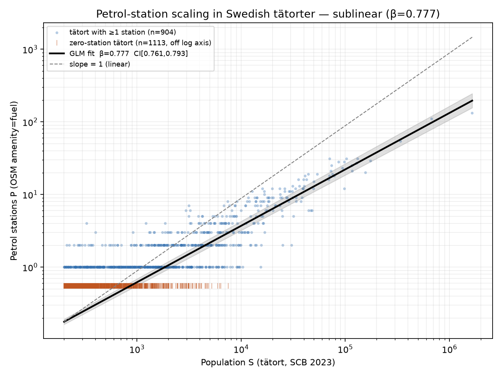
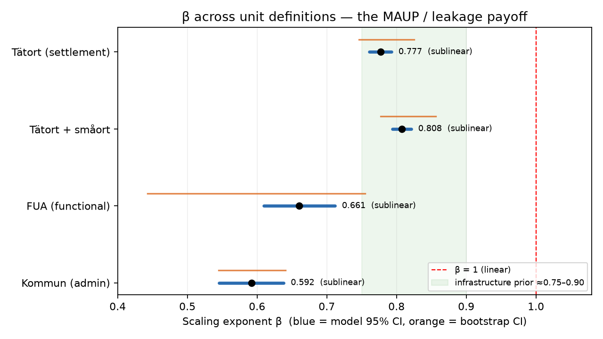
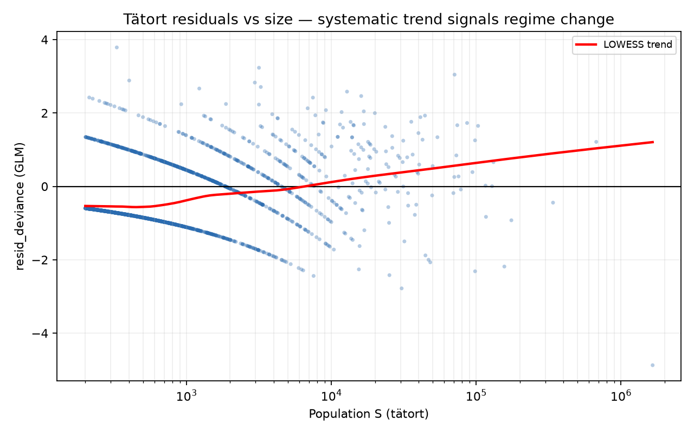
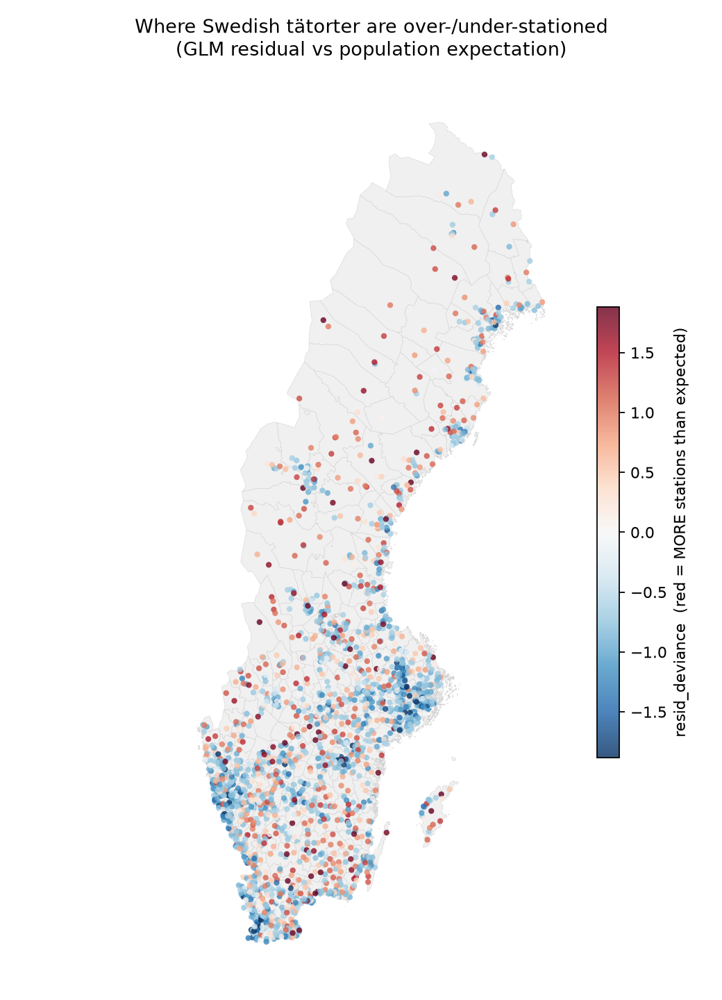
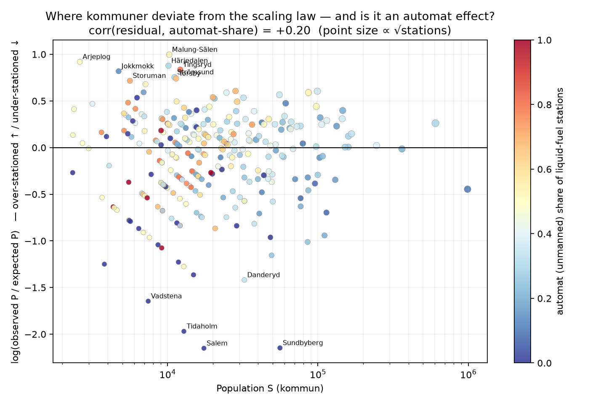
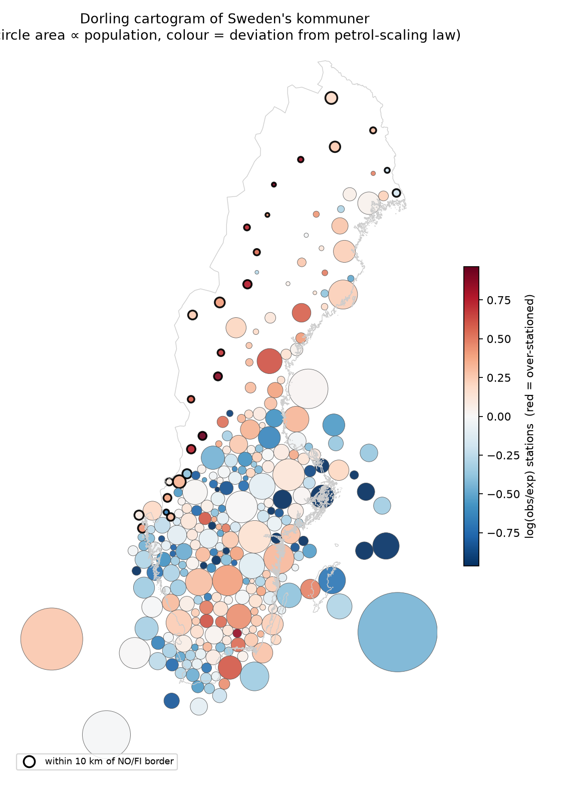
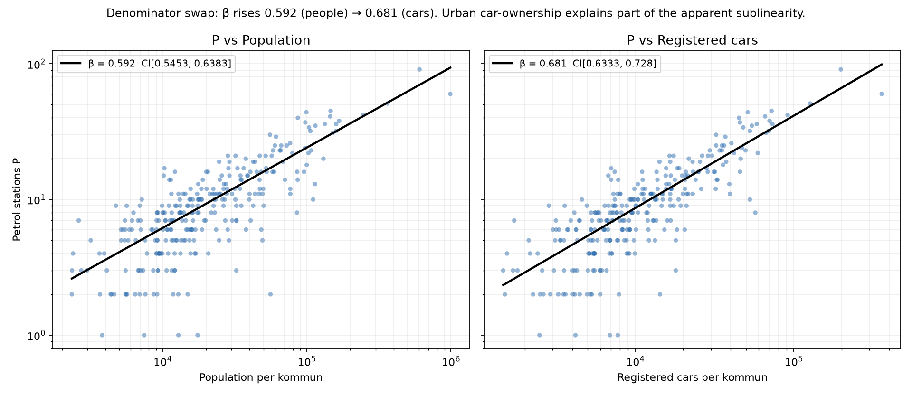

# Petrol-station population scaling in Sweden — P = C · Sᵝ

*Generated 2026-06-23 09:47 UTC. Random seed 17. National CRS EPSG:3006.*

**Question:** does the number of petrol stations P scale sublinearly (β < 1) with population S, and how much does β move with the choice of spatial unit (the Modifiable Areal Unit Problem)?

## Headline results (Model A: Negative-Binomial / Poisson GLM, log link)

| Unit definition | n units | Σ P | β | model 95% CI | bootstrap 95% CI | H₀: β=1 verdict |
|---|--:|--:|--:|---|---|---|
| Tätort (settlement) | 2017 | 2751 | **0.777** | [0.761, 0.793] | [0.746, 0.825] | sublinear (p=3.5e-169) |
| Tätort + småort | 5114 | 2900 | **0.808** | [0.794, 0.821] | [0.777, 0.856] | sublinear (p=9.3e-173) |
| FUA (functional) | 12 | 1290 | **0.661** | [0.610, 0.712] | [0.443, 0.755] | sublinear (p=9.6e-39) |
| Kommun (administrative) | 290 | 3246 | **0.592** | [0.545, 0.638] | [0.545, 0.641] | sublinear (p=2.7e-66) |

## Charts

*Headline: log-log P vs S for tätorter with GLM fit, 95% band, and the N zero-station units shown as a bottom rug (excluded from the log scatter only, retained in the fit).*

*Forest plot of β (95% CI) across all four unit definitions vs the β=1 reference and the ~0.75–0.90 infrastructure prior — the MAUP/leakage payoff.*

*Tätort GLM residuals vs population — a systematic trend signals departure from a single power law.*

*Residual map: tätorter coloured by over-/under-stationing relative to the population expectation.*

## Key findings

- **Tätort (primary functional unit): β = 0.777, 95% CI [0.761, 0.793] — sublinear** (z vs 1 = -27.725, p = 3.5e-169). Petrol provision scales clearly sublinearly with settlement population: doubling a town's population multiplies its stations by only ~2^0.78 ≈ 1.71, i.e. larger towns are more station-efficient per capita.

- **β moves a lot with the unit definition — 0.592 (Kommun (administrative)) to 0.808 (Tätort + småort), a spread of 0.22.** This MAUP spread is itself a primary result: the 'efficiency-with-population' claim is qualitatively robust (every definition is sublinear and excludes β=1) but its *magnitude* is not unit-invariant. Administrative kommuner give the most sublinear β because they bundle whole territories (dense city + sparse hinterland) into one large-S unit; tätorter measure settlement-internal scaling only.

- **15.7% of stations (512 of 3263) lie outside every tätort polygon** — rural automat chains (Din-X, Pump, Bilisten, Qstar) on roads between settlements. This is why tätort and kommun answer different questions: tätort = settlement-internal scaling (these rural stations are invisible); kommun = whole-territory scaling (they are captured, inflating P in low-density units and pushing β down).

- **Border leakage:** excluding the 26 kommuner within 10 km of the Norway/Finland land border moves kommun β from 0.592 to 0.635 (up). Border units are over-stationed for their resident population because cross-border demand (Norwegian fuel-price shopping around Strömstad/Svinesund; Haparanda–Tornio) adds stations that resident S does not explain. Caveat: the 10 km *land*-border flag does not capture the Öresund (Malmö–Copenhagen) fixed-link leakage, which is a ~25 km sea crossing.

- **Not a clean single power law (tätort):** a (log S)² term is significant (p = 6.5e-09). A segmented fit puts the breakpoint near S ≈ 3,673 inhabitants, with slope 0.9009 below and 0.7408 above — the largest cities scale *more* sublinearly than small towns.

- **OSM completeness vs the Drivkraft Sverige anchor:** 3263 deduped stations (from 3421 raw OSM amenity=fuel features, 2 private dropped) — within the tolerance band [1800, 3600], ratio 1.209× the ~2700 liquid-fuel sales-point anchor. The mild excess is expected: OSM also tags truck stops and small/private pumps the Drivkraft retail figure excludes, and 50 m dedup will not merge node+building pairs that sit >50 m apart.

- **Zeros and the OLS↔GLM gap:** the tätort set has 1113 zero-station units (kept by the GLM, dropped by OLS). Classic positives-only OLS gives β = 0.460 vs GLM β = 0.777; here OLS is *lower*, not higher, because dropping the many small zero-towns removes the low-S anchor that steepens the slope. (For kommun, with **no** zeros, OLS 0.600 ≈ GLM 0.592, confirming the gap is a zero-handling artefact, not a model-family one.) The GLM on counts with zeros retained is the correct estimator.

- **Versus the literature prior:** space-serving / distribution infrastructure typically scales at β ≈ 0.75–0.90. The tätort headline β = 0.777 sits right inside that band; the more aggregated kommun/FUA estimates fall below it, consistent with stronger sublinearity once rural territory is folded in.

## Follow-up: where the deviations are, and is population even the right denominator?

β is the all-Sweden summary; the **residuals** are where the structure lives. Two follow-ups: (1) which kommuner deviate from the scaling law and whether it is a station-*type* artefact, and (2) whether the sublinearity is partly just lower urban car ownership rather than genuine provision economies.

*Kommun residuals (log obs/expected stations) vs population, coloured by the unmanned-*automat* share of each kommun's stations; extreme deviations labelled.*

*Dorling cartogram — circle area ∝ population, colour = deviation from the petrol-scaling law, NO/FI border kommuner outlined. The empty north collapses; population-weighted geography remains.*

*Denominator swap: P vs population (β≈0.59) and P vs registered passenger cars (β≈0.68).*

- **Station type is a minor part of the deviation, not the cause.** Classifying stations by brand (full-service 1746, automat 961, vehicle-gas/biogas 77, unknown 479), the correlation between a kommun's residual and its automat share is only **+0.20**. Automat (unmanned) share does fall with size (0.424 small → 0.305 large), so cheap unmanned pumps do thicken the rural tail — but they explain little of the over-stationing. (Some 'fuel' nodes are actually biogas/CNG outlets — literally 'doing other things' — concentrated near the big cities.)

- **The deviations are a cross-boundary-demand map, in both directions.** Most over-stationed: Malung-Sälen, Arjeplog, Härjedalen, Tingsryd, Jokkmokk — sparse northern, ski-tourism (Sälen/Härjedalen) and E4-transit (Ljungby, Tingsryd) kommuner serving non-residents. Most under-stationed: Salem, Sundbyberg, Tidaholm, Vadstena, Danderyd — dense **Stockholm/Göteborg commuter suburbs** (e.g. Sundbyberg, ~56k residents but ~2 stations) whose residents fuel up in the core or in transit. Border over-stationing and suburban under-stationing are the same phenomenon: resident population is the wrong denominator wherever demand crosses the unit boundary.

- **Part of the sublinearity is just lower urban car ownership — but most of it is real.** Swapping the denominator from people to **registered passenger cars** (SCB/Trafikanalys 2025, all 290 kommuner) lifts β from **0.592 → 0.681**. Cars per capita fall with size (0.604 small → 0.492 large), so denser places genuinely own fewer cars; that accounts for ~22% of the gap from linearity. The remaining β = 0.681 is still firmly sublinear, so real provision economies (and through-traffic demand) survive the confounder — the naive population β just overstates the effect by ~0.09.

## Caveats

- Temporal mismatch: OSM fuel features are 'now' (2026 snapshot) while tätort/småort population is the SCB 2023 delineation and kommun population is GISCO/SCB 2024; a station opened/closed since does not move with population.

- FUA population is approximated by aggregating kommun (LAU) populations whose centroid falls in the FUA, as the GISCO FUA boundary file carries no population field; FUAs also truncate the size range (only the 12 largest Swedish places, no villages), so their β is the least comparable.

- Dedup at 50 m merges co-located node+polygon mappings of the same station but will split a single large highway service area with widely spaced pumps; conversely it could merge two genuinely distinct adjacent stations (rare).

---
See `methods.md` for exact datasets, vintages, URLs and field names; `results.json` for full numeric output; `manifest.json` for downloads.
